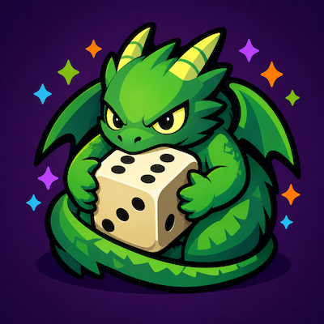

<div align="center">



# DragonDice

*Chat-driven dice games for World of Warcraft - deathroll today, gold roll beside it, and a registry that takes more.*

[](https://github.com/Xerrion/DragonDice/releases/latest)
[](https://github.com/Xerrion/DragonDice/blob/master/LICENSE)
[](https://worldofwarcraft.blizzard.com/)
[](https://www.curseforge.com/wow/addons/dragondice)
[](https://addons.wago.io/addons/dragondice)
[](https://github.com/Xerrion/DragonDice/actions)

</div>

DragonDice is a chat-driven dice-game framework: a 1v1 deathroller and a multi-player gold roll today, with a
self-registering game registry built to take more. It is the first consumer of
[DragonCore](https://github.com/Xerrion/DragonCore) and uses its Lifecycle, Listener, Locale, and Store primitives
end-to-end.

## 🐉 Features

- **Deathroll**: 1v1 elimination roller with auto-start, automatic roll-progression, and announced winner/payout
- **Gold roll**: multi-player wager game with `!join` quorum (2+), 15-second countdown, host short-circuit, and tie re-rolls
- **Self-registering game registry**: adding a third game is a new file under `Modules/Games/` plus locale entries
- **Slash + chat duality**: every host command works both as a slash command and as a `!dc` chat command in `/p`, `/raid`,
  instance, or `/say`
- **Announcement-only payouts**: no trade automation; results are announced and players settle by hand
- **AceLocale-3.0 localization**: full-English-sentence keys with silent enUS fallback
- **DragonCore-native**: built on DragonCore primitives (Lifecycle, Listener, Locale, Store) from day one

## 🎮 Supported Versions

| Version          | Interface | Status       |
|:-----------------|:----------|:-------------|
| Retail           | 120005    | ✅ Primary   |
| Mists Classic    | 50503     | ✅ Supported |
| TBC Anniversary  | 20505     | ✅ Supported |
| Classic Era      | 11508     | ✅ Supported |

## 📦 Installation

### Download

The recommended way to install DragonDice is via a management client like CurseForge or Wago.

- **CurseForge**: [Download](https://www.curseforge.com/wow/addons/dragondice) *(TODO: live link once published)*
- **Wago**: [Download](https://addons.wago.io/addons/dragondice) *(TODO: live link once published)*
- **GitHub**: [Latest Release](https://github.com/Xerrion/DragonDice/releases/latest)

### Manual Install

1. Install **[DragonCore](https://github.com/Xerrion/DragonCore)** first (hard dependency - DragonDice will refuse to
   load without it).
2. Download the latest DragonDice release.
3. Extract the `DragonDice` folder into your AddOns directory:

   ```text
   World of Warcraft/<flavor>/Interface/AddOns/DragonDice/
   ```

4. Restart World of Warcraft or type `/reload`.

## ⌨️ Commands

Use `/dc` or the long-form alias `/dragondice`.

| Command                          | Description                                                                   |
|:---------------------------------|:------------------------------------------------------------------------------|
| `/dc`                            | Show usage and the registered-games list                                      |
| `/dc deathroll open <bet>`       | Open a deathroll lobby for `<bet>` gold                                       |
| `/dc goldroll open <wager>`      | Open a multi-player gold roll for `<wager>` gold                              |
| `/dc goldroll start`             | Host short-circuit: begin rolling now                                         |
| `/dc status`                     | Print the active game's state to your chat frame                              |
| `/dc cancel`                     | Cancel the active game and announce it (host only)                            |
| `/dc reset`                      | Clear local state silently (host only)                                        |
| `/dc start`                      | Delegate to the active game's start verb, if any                              |

The host can also drive the same flow from group chat with `!dc`, e.g. `!dc deathroll 100`, `!dc goldroll 500`, or
`!dc goldroll start`. Players join by typing `!join` in `/p`, `/raid`, instance chat, or `/say`. Whispers are
intentionally not accepted.

### How a deathroll plays

1. Host: `/dc deathroll open 100`
2. Opponent (in `/p`, `/raid`, or `/say`): `!join`
3. Match starts: the host rolls `/roll 1000` automatically.
4. Players alternate `/roll <currentMax>` until someone rolls a 1.
5. The roller of the 1 loses; DragonDice announces the winner and payout.

### How a gold roll plays

1. Host: `/dc goldroll open 500`
2. Players (in `/p`, `/raid`, or `/say`): `!join`. Host may self-join.
3. Quorum (2+) reached: a 15s countdown starts; the host may begin immediately with `/dc goldroll start` or
   `!dc goldroll start`.
4. Every participant rolls `/roll <wager>` exactly once.
5. Highest and lowest rolls determine the result; the difference is what the lowest owes the highest. Ties at either
   end trigger a re-roll among the tied players.

Payouts are announcement-only ("Loser pays the bet" / "X owes Y Ng") - DragonDice never automates trade.

## ⚙️ Configuration

DragonDice stores per-character state in the `DragonDiceDB` SavedVariable, opened through `DragonCore.Store`. There is
no in-game options panel today; configuration is intentionally narrow because the games themselves are stateless from
the player's perspective.

## 🌍 Localization

DragonDice uses **DragonCore.Locale** (an AceLocale-3.0-compatible registry) with the workspace convention:

- Keys are **full English sentences**, not short codes.
- The base locale (`Locales/enUS.lua`) registers values as the boolean sentinel `true`; the locale layer normalises
  this so reads of `L["X"]` resolve to `"X"` without observing the sentinel.
- Missing translations fall back to enUS silently.

Locale files live in `Locales/`. Translation contributions are welcome via GitHub pull requests.

## 🏗 DragonCore Consumer

DragonDice is the reference shape for DragonCore consumers: a thin `Core.lua` that wires Lifecycle, per-concern modules
under `Modules/`, locale registration from day one, and a hard dependency on DragonCore. Game modules live in
`Modules/Games/` and self-register on a per-addon registry; adding a third game is a new file in that directory plus
locale entries - no Core wiring required.

## 🤝 Contributing

Contributions are welcome! Please read [CONTRIBUTING.md](CONTRIBUTING.md) for setup, coding standards, and the PR
process. All contributors are expected to follow the [Code of Conduct](CODE_OF_CONDUCT.md).

For developer-facing architecture notes, see [`AGENTS.md`](AGENTS.md) in the repository root.

## ❤️ Support

If you would like to support DragonDice, you can sponsor the project on
[GitHub Sponsors](https://github.com/sponsors/Xerrion) or buy me a coffee on [Ko-fi](https://ko-fi.com/Xerrion).

## 📄 License

This project is licensed under the **MIT License**. See the
[LICENSE](https://github.com/Xerrion/DragonDice/blob/master/LICENSE) file for details.

Made with ❤️ by [Xerrion](https://github.com/Xerrion)
